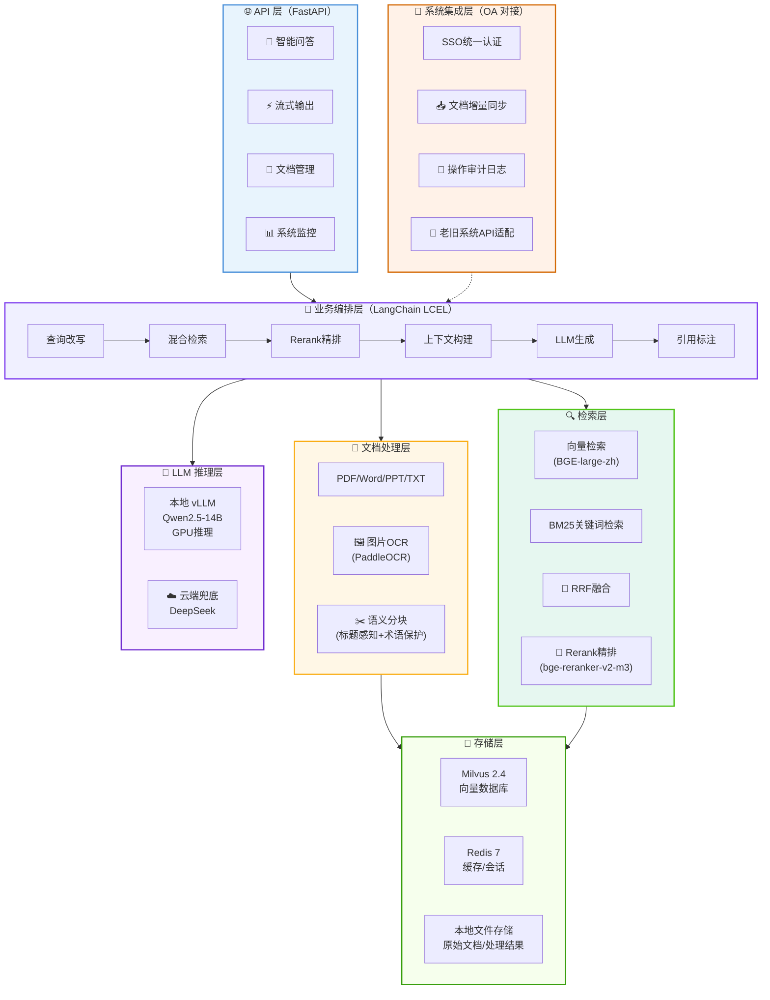

<div align="center">

# 🏭 Manufacturing RAG System

**制造业企业知识库智能问答系统**

[](https://www.python.org/)
[](https://fastapi.tiangolo.com/)
[](https://python.langchain.com/)
[](https://milvus.io/)
[](LICENSE)

**私有化部署 · 混合检索 · 多模态解析 · 效果可量化**

[架构设计](#-架构设计) · [核心功能](#-核心功能) · [快速开始](#-快速开始) · [性能指标](#-性能指标) · [技术博客](#-技术博客)

</div>

---

## 📖 项目背景

在制造业企业中，技术部门积累了大量设备手册、工艺规范、维修工单等知识文档，分散在多个老旧系统中。技术人员查找资料平均耗时 **40 分钟/次**，新人上手周期长达 **2 个月**。

本项目基于 RAG（Retrieval-Augmented Generation）技术，构建了一套**纯内网私有化部署**的智能问答系统，将分散的知识文档转化为可智能检索的知识库，实现"问有所答、答有所据"。

> 💡 **FDE 视角**：本项目完整覆盖了从需求调研、老旧系统对接、私有化部署、效果调优到交付培训的全流程，是典型的 AI 落地项目。

---

## 🏗 架构设计

### 系统架构图



### 技术选型决策

| 模块 | 选型 | 备选方案 | 选型理由 |
|------|------|----------|----------|
| 向量库 | Milvus 2.4 | Pinecone / Weaviate | 私有化部署、支持十亿级向量、HNSW索引性能优异 |
| 嵌入模型 | BGE-large-zh | text2vec / m3e | 中文检索效果SOTA、1024维、支持指令微调 |
| Reranker | bge-reranker-v2-m3 | Cohere Rerank | 开源可私有化、多语言、精排效果提升显著 |
| LLM推理 | vLLM + Qwen2.5-14B | Ollama / Text Generation Inference | PagedAttention连续批处理、吞吐量3倍提升 |
| 文档解析 | PyMuPDF + PaddleOCR | Unstructured / LlamaParse | 本地部署、中文OCR准确率高、支持扫描件 |
| API框架 | FastAPI | Flask / Django | 异步高性能、自动生成API文档、类型安全 |

详细技术选型分析请参考 [docs/tech-selection.md](docs/tech-selection.md)。

---

## ✨ 核心功能

### 1. 多格式文档智能解析

- **格式支持**：PDF、Word、PPT、TXT、图片（PNG/JPG）
- **扫描件OCR**：基于 PaddleOCR，中文识别准确率 > 95%
- **语义分块**：按标题层级切分 + 固定长度兜底，专业术语不切断
- **行业词典**：内置 2000+ 制造业专业术语，优化分词和召回

### 2. 混合检索 + 精排

- **双路召回**：向量语义检索 + BM25关键词检索
- **RRF融合**：Reciprocal Rank Fusion 加权融合两路结果
- **Rerank精排**：BGE-Reranker 对 Top-K 结果精排，提升准确率
- **相似度阈值**：可配置阈值过滤低相关结果

### 3. 私有化 LLM 推理

- **本地部署**：vLLM 部署 Qwen2.5-14B，数据不出内网
- **云端兜底**：本地故障自动切换 DeepSeek，保障可用性
- **流式输出**：SSE 流式响应，首字延迟 < 500ms
- **Prompt工程**：针对制造业场景优化的系统提示词和问答模板

### 4. OA 系统深度集成

- **SSO认证**：对接企业 OA 统一身份认证
- **增量同步**：每日凌晨自动同步 OA 新增/更新文档
- **审计日志**：所有查询和操作记录写入 OA 审计系统
- **老旧系统适配**：支持 REST API、数据库直连、文件共享等多种对接方式

### 5. 可量化的效果评测

- **评测集**：500 条真实业务问答构建的评测集
- **多维度指标**：准确率、召回率、相关性、延迟、引用覆盖率
- **持续优化**：评测驱动的分块策略、检索参数、Prompt 调优
- **A/B测试**：支持不同配置的对比评测

---

## 🚀 快速开始

### 环境要求

| 组件 | 最低要求 | 推荐配置 |
|------|----------|----------|
| Python | 3.10+ | 3.11 |
| GPU | - | NVIDIA A10 / RTX 4090 (≥16GB显存) |
| 内存 | 16GB | 32GB |
| 磁盘 | 50GB | 200GB SSD |
| Docker | 20.10+ | 24.0+ |

### 方式一：Docker Compose 一键部署（推荐）

```bash
# 1. 克隆项目
git clone https://github.com/M9T040705/manufacturing-rag-system.git
cd manufacturing-rag-system

# 2. 配置环境变量
cp .env.example .env
# 编辑 .env，配置模型路径、GPU设备等

# 3. 下载模型到 models/ 目录
# Qwen2.5-14B-Instruct, BGE-large-zh-v1.5, bge-reranker-v2-m3

# 4. 一键启动
cd deploy/docker
docker-compose up -d

# 5. 查看服务状态
docker-compose ps
```

### 方式二：本地开发部署

```bash
# 1. 创建虚拟环境
python -m venv venv
source venv/bin/activate  # Windows: venv\Scripts\activate

# 2. 安装依赖
pip install -r requirements.txt

# 3. 启动依赖服务（Milvus + Redis）
docker-compose -f deploy/docker/docker-compose.yml up -d milvus etcd minio redis

# 4. 批量入库文档
python scripts/ingest_docs.py --dir ./data/raw

# 5. 启动 API 服务
uvicorn src.api.main:app --host 0.0.0.0 --port 8000 --reload
```

### 验证部署

```bash
# 健康检查
curl http://localhost:8000/api/health

# 智能问答
curl -X POST http://localhost:8000/api/chat \
  -H "Content-Type: application/json" \
  -d '{"question": "什么是调质处理？工艺参数是多少？"}'

# API 文档
open http://localhost:8000/docs
```

详细部署指南请参考 [docs/deployment-guide.md](docs/deployment-guide.md)。

---

## 📊 性能指标

### 系统性能

| 指标 | 数值 | 测试条件 |
|------|------|----------|
| 文档入库速度 | ~500 页/分钟 | A10 GPU, 批量32 |
| 检索延迟 (P95) | < 200ms | 10万向量, HNSW索引 |
| 问答总延迟 (P95) | < 3s | 含LLM生成, 流式输出 |
| 首字延迟 | < 500ms | vLLM连续批处理 |
| 并发支持 | 50 并发查询 | 压力测试通过 |
| 系统可用性 | 99.7% | 上线3个月统计 |

### 效果优化历程

| 优化阶段 | 准确率 | 关键优化 |
|----------|--------|----------|
| 基线 (固定分块+纯向量) | 62% | - |
| + 语义分块 (标题感知) | 71% | 按标题层级切分，专业术语保护 |
| + 混合检索 (向量+BM25) | 78% | RRF融合双路召回，专业术语查询提升22% |
| + Reranker精排 | 89% | BGE-Reranker Top-5精排，最终答案准确率+11% |
| + 行业词典+Prompt优化 | 91% | 2000+制造业术语，场景化Prompt |

### 业务价值

| 指标 | 优化前 | 优化后 | 提升 |
|------|--------|--------|------|
| 资料查找时间 | 40 分钟/次 | 10 分钟/次 | ↓ 75% |
| 新人上手周期 | 2 个月 | 3 周 | ↓ 62% |
| 重复问题咨询量 | 120 次/周 | 35 次/周 | ↓ 71% |
| 技术人员满意度 | 6.2/10 | 8.7/10 | ↑ 40% |

---

## 📁 项目结构

```
manufacturing-rag-system/
├── src/
│   ├── api/                          # API 服务层
│   │   ├── main.py                  # FastAPI 主应用（路由、生命周期）
│   │   └── schemas.py               # Pydantic 请求/响应模型
│   ├── document_processor/           # 文档处理模块
│   │   ├── loader.py                # 多格式文档加载器（PDF/Word/PPT/图片）
│   │   ├── chunker.py               # 语义分块器（标题感知+术语保护）
│   │   └── ocr.py                   # PaddleOCR 封装（扫描件识别）
│   ├── retriever/                    # 检索模块
│   │   ├── vector_store.py          # Milvus 向量库管理（CRUD+索引）
│   │   ├── hybrid_retriever.py      # 混合检索器（向量+BM25+RRF融合）
│   │   └── reranker.py              # Reranker 精排器（BGE-Reranker）
│   ├── llm/                          # LLM 推理模块
│   │   ├── llm_client.py            # 统一 LLM 客户端（本地vLLM+云端兜底）
│   │   └── prompt_templates.py      # Prompt 模板库（制造业场景优化）
│   ├── integrations/                 # 系统集成
│   │   ├── oa_client.py             # OA 系统客户端（SSO+文档+审计）
│   │   └── data_sync.py             # 数据同步管理器（增量同步+断点续传）
│   └── evaluation/                   # 评测模块
│       └── evaluator.py             # RAG 评测器（准确率/召回率/延迟）
├── config/
│   └── settings.py                  # 全局配置（pydantic-settings）
├── scripts/
│   ├── ingest_docs.py               # 批量文档入库脚本
│   └── run_evaluation.py            # 系统评测脚本
├── deploy/
│   └── docker/
│       ├── Dockerfile               # 应用镜像（多阶段构建）
│       └── docker-compose.yml       # 编排配置（应用+Milvus+Redis+vLLM）
├── docs/                             # 技术文档
│   ├── architecture.md              # 架构设计详解
│   ├── tech-selection.md            # 技术选型决策记录
│   └── deployment-guide.md          # 部署运维指南
├── tests/                            # 单元测试
├── data/                             # 数据目录（.gitignore）
├── requirements.txt                  # Python 依赖
├── .env.example                      # 环境变量示例
├── .gitignore                        # Git 忽略规则
├── CHANGELOG.md                      # 变更日志
├── CONTRIBUTING.md                   # 贡献指南
├── LICENSE                           # MIT 许可证
└── README.md                         # 项目说明（本文件）
```

---

## 🔧 API 接口

### 核心接口

| 方法 | 路径 | 说明 |
|------|------|------|
| POST | `/api/chat` | 智能问答（非流式） |
| POST | `/api/chat/stream` | 智能问答（SSE流式） |
| POST | `/api/documents/ingest` | 文档上传入库 |
| DELETE | `/api/documents` | 删除文档 |
| GET | `/api/health` | 健康检查 |
| GET | `/api/stats` | 系统统计 |

### 问答示例

**Request:**
```json
{
  "question": "什么是调质处理？工艺参数是多少？",
  "stream": false,
  "use_rerank": true
}
```

**Response:**
```json
{
  "answer": "调质处理是指将工件淬火后进行高温回火的复合热处理工艺...",
  "session_id": "a1b2c3d4-...",
  "sources": [
    {
      "content": "调质处理：淬火+高温回火...",
      "source": "热处理工艺手册.pdf",
      "page": 45,
      "score": 0.92
    }
  ],
  "latency_ms": 1850,
  "retrieval_latency_ms": 120,
  "llm_latency_ms": 1730
}
```

完整 API 文档请访问 `http://localhost:8000/docs`（Swagger UI）。

---

## 📝 技术博客

本项目沉淀了一系列技术实践文章：

- [架构设计详解](docs/architecture.md) — RAG 系统的分层架构与设计权衡
- [技术选型决策](docs/tech-selection.md) — 向量库/嵌入模型/推理框架的选型对比
- [部署运维指南](docs/deployment-guide.md) — 私有化部署、GPU配置、性能调优
- [效果优化实践](docs/optimization-journey.md) — 从62%到91%准确率的优化历程
- [FDE 落地经验](docs/fde-experience.md) — 驻场交付、老旧系统对接、客户培训

---

## 🤝 贡献指南

欢迎提交 Issue 和 Pull Request！请先阅读 [CONTRIBUTING.md](CONTRIBUTING.md) 了解贡献流程。

### 开发环境搭建

```bash
# 安装开发依赖
pip install -r requirements.txt
pip install pytest black isort

# 代码格式化
black src/
isort src/

# 运行测试
pytest tests/ -v
```

### 提交规范

本项目采用 [Conventional Commits](https://www.conventionalcommits.org/) 规范：

```
feat: 新功能
fix: 修复bug
docs: 文档更新
style: 代码格式（不影响功能）
refactor: 重构
perf: 性能优化
test: 测试相关
chore: 构建/工具相关
```

---

## 📄 许可证

本项目基于 [MIT License](LICENSE) 开源。

---

<div align="center">

**如果这个项目对你有帮助，欢迎给个 ⭐ Star！**

Made with ❤️ by [M9T](https://github.com/M9T040705)

</div>
